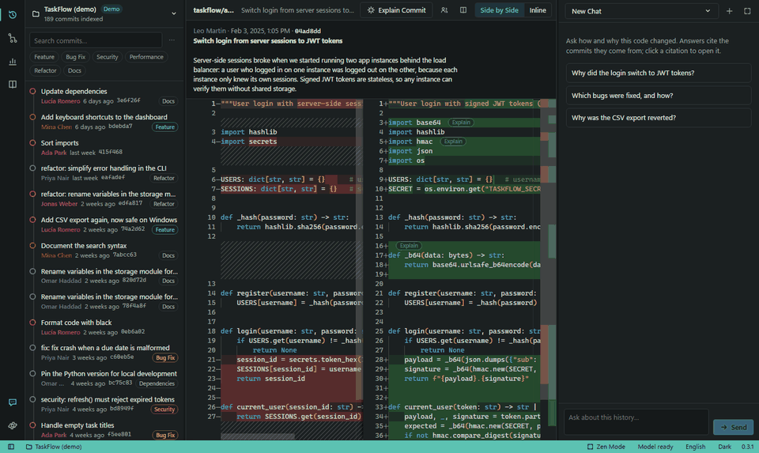
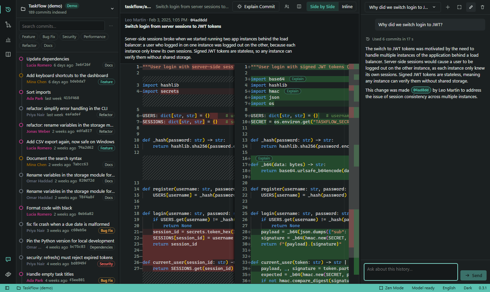
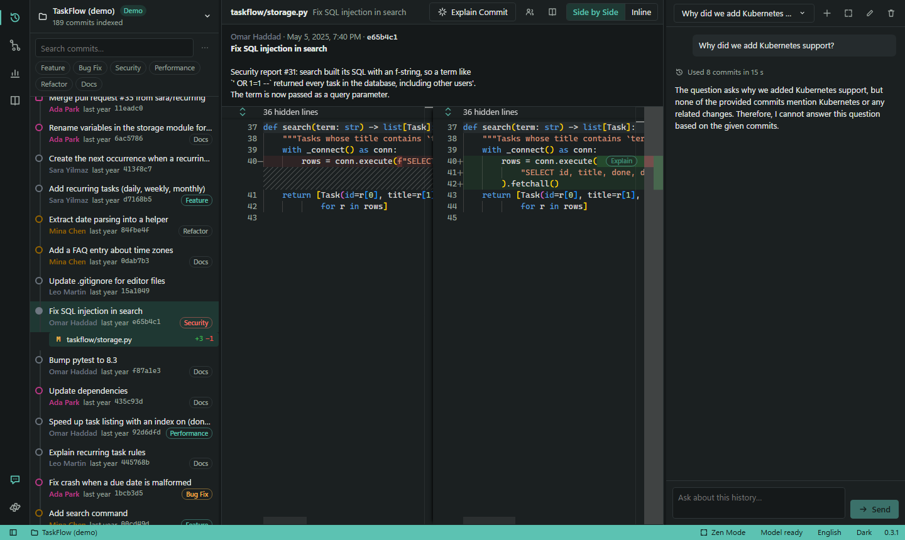
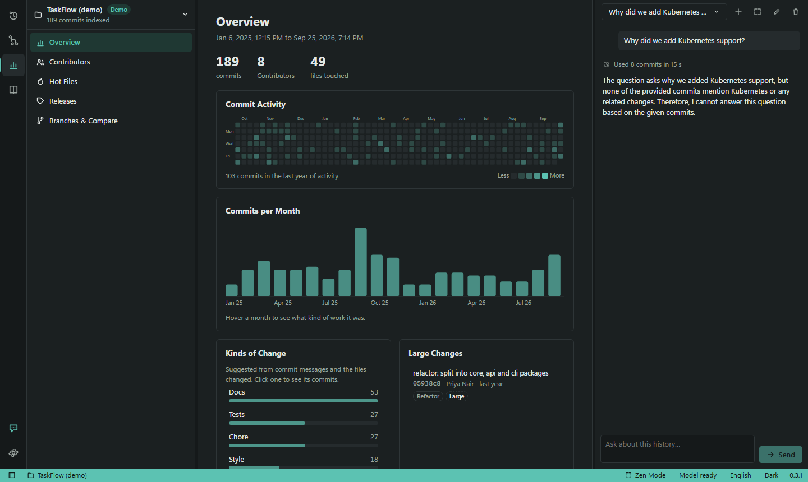
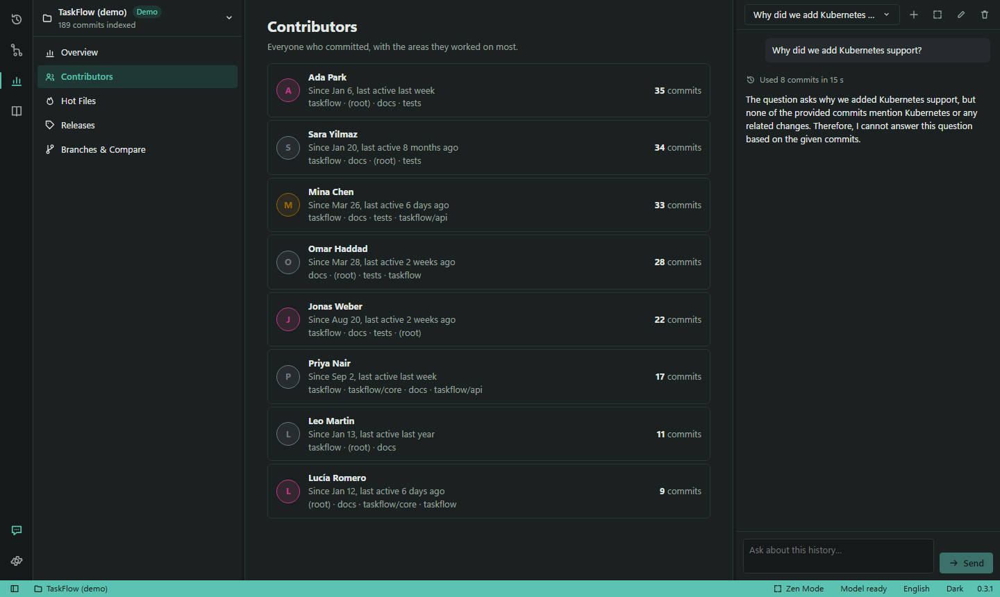
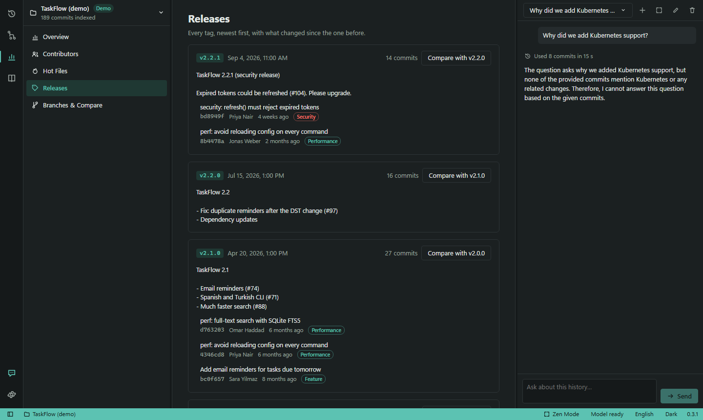
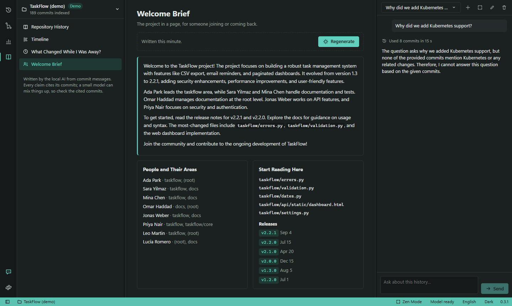
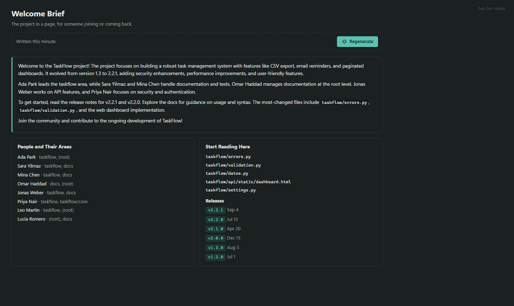
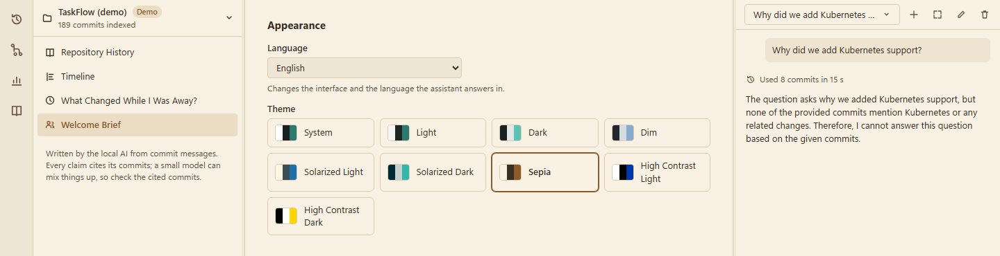
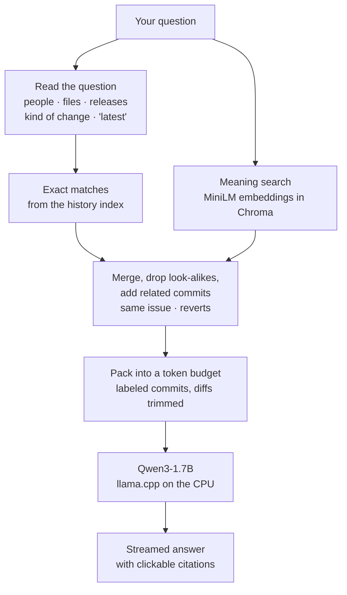

<div align="center">

# GitLore

**Ask your Git history why. A private AI that reads the commits, runs on your own computer, and cites its evidence.**

[](https://github.com/MetehanDemirel/GitLore/actions/workflows/ci.yml)
[](https://github.com/MetehanDemirel/GitLore/releases)
[](LICENSE)




</div>

GitLore is a small, VS Code-like workspace for a repository's history. Browse commits and colored diffs,
see who changed what and when, and ask plain-language questions. A 1.7B-parameter model running **on your
CPU** answers from the actual commits and cites each one. No API keys, no cloud, no GPU, and nothing leaves
your machine. It closes itself when you close the tab.

```bash
git clone https://github.com/MetehanDemirel/GitLore.git && cd GitLore
./start.sh        # Windows: double-click start.bat
```

A built-in demo project, **TaskFlow** (189 commits, 8 people, 9 releases), opens on first launch, so
everything can be tried right away.

---

## What's Inside

| | |
|---|---|
|  | **Workspace.** Commit timeline with author colors and category chips, side-by-side or inline diffs (Monaco, VS Code's editor), full commit messages. Edit files and commit, Ctrl+S to save. |
|  | **One-click explanations.** *Explain Commit* in the header, a small *Explain* on every changed block, or select any code → right-click → *Ask GitLore*. Citations in answers open the commit. |
|  | **Insights, instantly and without AI.** Commit heatmap, activity per month, kinds of change (features, fixes, security, performance, refactors, docs…), large changes, hot files, *who wrote this?* |
|  | **People.** Everyone who committed, their active periods and the parts of the code they work on. Minimal profiles: no rankings, no scores. |
|  | **Releases, branches, compare.** What changed in each tag, branches and how far they diverge, any two commits side by side. |
|  | **The story of a repository.** The AI writes a cited *Repository History* (release by release), a *Timeline* of key events, *What Changed While I Was Away?* and a *Welcome Brief* for newcomers. Written once, cached, regenerated when history moves on. |
|  | **Calm by default.** Every panel hides (Ctrl+B, Ctrl+Alt+B); Zen mode (Ctrl+K Z) leaves only the editor, or only the chat. |
|  | **Nine themes**, including Solarized, Sepia and two high-contrast themes, all checked against WCAG contrast. Interface in English, Turkish, French and German; answers also in Spanish, Italian and Chinese. |

**Search like you think:** `author:priya type:security path:auth since:2025-06 release:v2.0.0 is:large token`.

**Online mode (optional):** paste `github.com/owner/repo` and GitLore keeps a read-only, shallow copy up to
date while it's open, and shows the pull requests and issues behind each commit. Public repositories only,
no sign-in, nothing stored (a `GITHUB_TOKEN` environment variable raises GitHub's rate limit).

## Who It's For

- **Joining a project**: read the Welcome Brief, see who owns what, ask "why is it built like this?"
- **Coming back after a while**: *What changed while I was away?* since your last visit or any date.
- **Reviewing or debugging**: "why was this reverted?", "when did this check appear and why?", "what changed in v1.1.1?"
- **Maintainers**: release notes material, hot files, security and performance history at a glance.
- **Anyone who can't send code to a cloud AI**: everything runs locally and offline.

## How the AI Works



Small models are fast but easily misled, so most of GitLore's accuracy comes from **what the model is shown**:

- **Retrieval that reads the question.** Meaning search alone is bad at filter questions ("what did Priya
  do?", "the latest changes", "security fixes", "what's in v1.1.1?"). GitLore first reads the question for
  people, files, releases, kinds of change and recency, and pulls those commits directly from a Git index;
  meaning search fills in the rest. Repeated look-alike commits ("Update screenshots" ×5) are skipped.
- **Digging for *why*.** For the top commits it also brings in the commit a revert undid, later commits that
  redo it, and commits about the same issue number, because the reason is often written there.
- **Grounding rules near the question.** Small models follow the instructions closest to the end, so "answer
  this exact question, use only these commits, cite each claim" is restated after the question, and each
  commit is shown with labeled *Author* and *Date* fields.
- **Conversations that stay on topic.** Follow-ups ("Who did that?", "When was it added back?") keep the
  previous answer's commits and are marked as follow-ups to the earlier question.
- **Honest when it doesn't know.** The model was chosen partly because it says "the commits don't say" instead
  of inventing a reason (see below). Citations of commits that don't exist are removed from written stories.
- **Instant first, AI second.** Categories, contributors, heatmaps, releases, blame and search are computed
  from Git directly in milliseconds. The model is used only where language is needed, and long texts are
  cached, so it never blocks the interface.
- **CPU-friendly.** Qwen3 runs with `/no_think` (no slow hidden reasoning), prompts stay within ~1,800
  tokens, diffs are trimmed per commit, and the model is shared between chat and story writing.

## How Well It Works

### Answer quality

`scripts/eval_answers.py` asks 15 questions about the demo project with the real model and checks that the
right commits reached the model, that the answer cites them, that no commit hash is made up, that the key
facts appear, and that nothing repeats. It covers *why* questions, lists, people, files, releases,
follow-ups, and a trap question the history can't answer.

| Version | Passed | Notes |
|---|---|---|
| Before (meaning search only) | **8 / 15** | Missed filter questions; follow-ups failed |
| v0.3.1 | **14 / 15** | The one miss: two commits named almost the same ("Add CSV export" vs "… again") get mixed up |

Real answers, recorded by `scripts/capture_media.py` (full set in [docs/media/answers.md](docs/media/answers.md)):

> **Why did we switch login to JWT?**
>
> The switch to JWT tokens was motivated by the need to handle multiple instances of the application behind
> a load balancer. Server-side sessions would cause a user to be logged out on the other instance, as each
> instance only knew its own sessions. Signed JWT tokens are stateless, meaning any instance can verify them
> without shared storage.
>
> This change was made [04ad8dd] by Leo Martin to address the issue of session consistency across multiple instances.

> **List the security fixes.**
>
> Security: refresh() must reject expired tokens [bd8949f] · Security: rate-limit failed logins [457216d] ·
> Security: Fix SQL injection in search [e65b4c1] · Security: Hash passwords with PBKDF2 instead of plain
> SHA-256 [42a66f5], each with a one-line explanation of the risk it closed.

> **Why did we add Kubernetes support?** *(a trap: it never happened)*
>
> The question asks why we added Kubernetes support, but none of the provided commits mention Kubernetes or
> any related changes. Therefore, I cannot answer this question based on the given commits.

Small-model limits remain: in the full set, the CSV answer explains the revert correctly but credits the
later fix to the original commit. Every answer shows the commits it used, so claims can be checked in one click.

### Choosing the model

Nine small models ran GitLore's real pipeline on 300 commits of `psf/requests` (i5-11400H laptop CPU, 4-bit
quantization): five questions with known answers, including a trap question.

| Model | Size | First word | Speed | Score |
|---|---|---|---|---|
| **Qwen3-1.7B** (default) | 1.1 GB | 10 s | 24 tokens/s | **9 / 10** |
| Qwen3-4B-Instruct-2507 | 2.4 GB | 26 s | 10 tokens/s | 9 / 10 |
| LFM2-2.6B | 1.6 GB | 16 s | 20 tokens/s | 8 / 10 |
| Qwen2.5-Coder-3B | 2.1 GB | 18 s | 14 tokens/s | 7 / 10 |
| LFM2.5-1.2B | 0.7 GB | 7 s | 38 tokens/s | 5 / 10 |
| Llama-3.2-1B | 0.8 GB | 6 s | 32 tokens/s | 5 / 10 |
| Qwen2.5-Coder-1.5B | 1.1 GB | 10 s | 26 tokens/s | 4 / 10 |

Only the Qwen3 models answered the trap question honestly; the others invented a reason. Qwen3-4B matched
the 1.7B's score at 2.5× the wait. Any other GGUF model can be used via *Custom GGUF* in Settings.

### Speed

On a mid-range laptop CPU, an answer takes about **15–25 seconds** (the model reads ~1,500 tokens of commits,
then writes at ~20 tokens/s). Indexing the demo takes a few seconds; insights open instantly; a Welcome Brief
takes about 20 s and a full Repository History about 1.5 minutes, both cached afterwards.

## Install and Run

You need [Git](https://git-scm.com) and either [uv](https://docs.astral.sh/uv/) (recommended) or Python
3.11–3.13. Run `start.bat` (Windows) or `./start.sh` (macOS/Linux). The first run installs everything into
`.venv` and asks to download the model (1.1 GB, once); afterwards it starts in seconds and works offline.
Close the browser tab and GitLore exits by itself.

Requirements: about 4 GB of disk, 8 GB of RAM recommended. Windows, macOS (Apple Silicon and Intel) and Linux.

<details>
<summary><b>Manual install</b></summary>

```bash
uv venv --python 3.12
source .venv/bin/activate          # Windows: .venv\Scripts\activate
uv pip install -r requirements.txt # Linux: add --no-binary llama-cpp-python --index-strategy unsafe-best-match
python gitlore.py
```

With plain pip: `python -m venv .venv`, activate it, `pip install -r requirements.txt` (Python 3.11–3.13).
On Linux the LLM library is compiled once (needs a C++ compiler such as `build-essential`, about 5 minutes).

Useful environment variables: `GITHUB_TOKEN` (online mode rate limit), `GITLORE_DATA_DIR` (where models,
indexes and chats live), `GITLORE_NO_BROWSER=1`.

</details>

<details>
<summary><b>Troubleshooting</b></summary>

| Problem | Fix |
|---|---|
| `llama-cpp-python` tries to compile, "CMake" or "cl.exe not found" | Unsupported Python (usually 3.14) or not installed from `requirements.txt` (it has the prebuilt-wheel index). Use `uv venv --python 3.12`. |
| `tokenizers` build error mentioning Rust | Packages installed without `requirements.txt`'s `huggingface-hub<2` cap. Reinstall from `requirements.txt`. |
| "git not found" | Install Git and reopen the terminal. |
| Answers are slow | Normal on a CPU: 15–25 s per answer. Close other heavy programs. |
| macOS + Python 3.13: "ZIP file contains trailing contents" | That prebuilt file is broken upstream. Use Python 3.12 (the launcher does). |
| Linux: "A C++ compiler is needed" | `sudo apt install build-essential` (Debian/Ubuntu) or `sudo dnf install gcc-c++` (Fedora), then run `./start.sh` again. |
| Intel Mac: the install compiles for a long time | No prebuilt build exists for Intel Macs; it compiles once (needs Xcode Command Line Tools). |

To uninstall, delete the folder (and `~/.cache/chroma/` for the embedding model). GPU acceleration is not set
up on purpose, to keep installation simple; a GPU-enabled `llama-cpp-python` installed by hand is used automatically.

</details>

## Under the Hood

| Part | Choice | Why |
|---|---|---|
| Model runtime | `llama-cpp-python` 0.3.19, CPU wheels | No compiler, no CUDA, no Ollama; the model runs inside the app and stops with it |
| Model | Qwen3-1.7B, Q4_K_M GGUF | Best accuracy for its speed in our benchmark, honest on trap questions, Apache-2.0 |
| Search | Chroma + built-in MiniLM (ONNX) | Meaning search without PyTorch (saves ~2 GB) |
| Git | GitPython plus one `git log --numstat` pass | The history index behind insights, filters and categories |
| Server | Starlette + Uvicorn on 127.0.0.1 | Streaming answers (SSE), background jobs, host checks, JSON-only requests |
| Interface | Preact + htm, Monaco editor | No build step; Monaco is downloaded once with an integrity check |
| Storage | SQLite | Projects, chats, cached stories and GitHub responses |
| Demo | `git fast-import` | The 189-commit demo is generated identically on every computer in a fraction of a second |

Tests: 150 unit, API and browser tests (Playwright) run on Windows, macOS and Linux on every push, plus a
check that the one-click launcher starts the app on all three. Security: the server only answers on
127.0.0.1, checks the Host header, refuses non-JSON requests, never writes outside a project, and online
copies are read-only.

## Roadmap

- Interface translations for Spanish, Italian and Chinese (answers already work), and for the newest screens in Turkish, French and German
- Private GitHub repositories (sign-in)
- Saved searches

See [CHANGELOG.md](CHANGELOG.md) for what changed in each version. Licensed under [MIT](LICENSE).
